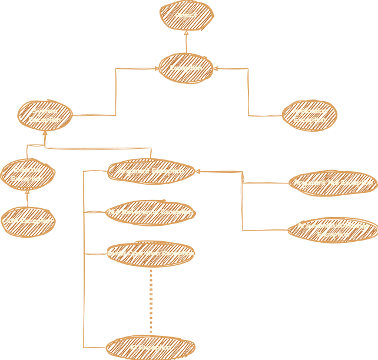

# Exception ❤🍕

**Links:**

- [Exception](https://github.com/SMitra1993/theNETInterrogation/blob/master/14%20-%20Exception.md#exception--1)
- [System Level Exception vs Application Level Exception](https://github.com/SMitra1993/theNETInterrogation/blob/master/14%20-%20Exception.md#system-level-exception-vs-application-level-exception-)
- [Exception Heirarchy](https://github.com/SMitra1993/theNETInterrogation/blob/master/14%20-%20Exception.md#exception-heirarchy-)
- [Multiple Catch clause](https://github.com/SMitra1993/theNETInterrogation/blob/master/14%20-%20Exception.md#multiple-catch-clause-)
- [`finally` keyword](https://github.com/SMitra1993/theNETInterrogation/blob/master/14%20-%20Exception.md#finally-keyword-)

## **Exception:** [🏠](https://github.com/SMitra1993/theNETInterrogation/blob/master/14%20-%20Exception.md#exception-)

In C#, an exception is an unexpected or exceptional condition that occurs during the execution of a program and disrupts the normal flow of control. Exceptions can arise due to various reasons such as invalid inputs, file I/O errors, network failures, or logical errors in the program.

When an exception occurs, it is typically represented by an object of a class derived from the `Exception` class. The .NET Framework provides a hierarchy of exception classes that allow for different types of exceptions to be handled in a structured manner.

Here's an example demonstrating how exceptions are thrown and caught in C#:

```csharp
using System;

class Program
{
    static void Main(string[] args)
    {
        try
        {
            // Attempt to perform a division by zero
            int result = Divide(10, 0);
            Console.WriteLine($"Result of division: {result}");
        }
        catch (DivideByZeroException ex)
        {
            // Handle the specific exception
            Console.WriteLine($"Error: {ex.Message}");
        }
        catch (Exception ex)
        {
            // Handle any other exceptions
            Console.WriteLine($"An error occurred: {ex.Message}");
        }
    }

    static int Divide(int dividend, int divisor)
    {
        // Attempt to divide two numbers
        return dividend / divisor;
    }
}
```

In this example, we have a `Divide` method that attempts to perform a division operation. However, if the divisor is zero, a `DivideByZeroException` is thrown. We use a `try-catch` block to catch this exception and handle it gracefully. 

When you run the program, you'll see that the exception is caught by the `catch` block, and the appropriate error message is displayed:

```
Error: Attempted to divide by zero.
```

By handling exceptions in this manner, you can prevent your program from crashing and provide meaningful feedback to the user about the encountered error. It's important to handle exceptions appropriately in your code to ensure robustness and reliability.

## **System Level Exception vs Application Level Exception:** [🏠](https://github.com/SMitra1993/theNETInterrogation/blob/master/14%20-%20Exception.md#exception-)

| Aspect                    | System Level Exception                           | Application Level Exception                             |
|---------------------------|--------------------------------------------------|--------------------------------------------------------|
| Source                    | Arises from the underlying system or framework.   | Arises from within the application's code.             |
| Scope                     | Can affect the entire system or application.      | Typically limited to the specific application context.  |
| Examples                  | Network errors, memory access violations, etc.    | Invalid user input, database connectivity issues, etc. |
| Handling Responsibility   | Often handled by the runtime environment.         | Needs to be handled explicitly by the application.     |
| Severity                  | May lead to system instability or crashes.         | Mostly affects application functionality.              |
| Recovery Strategy         | Often requires system-level intervention.         | Can often be gracefully handled within the application.|
| Exception Types           | Includes exceptions defined by the .NET framework.| Custom exceptions defined by the application.           |
| Impact on Application    | Can impact multiple components or modules.        | Usually impacts the specific area where it occurred.   |

In summary, system-level exceptions originate from the underlying infrastructure or runtime environment and may have broader implications, potentially affecting the entire system. Application-level exceptions, on the other hand, arise from within the application's codebase and are typically confined to specific application logic or operations. Handling application-level exceptions is the responsibility of the application developer, while system-level exceptions may require intervention at the system level.

## **Exception Heirarchy:** [🏠](https://github.com/SMitra1993/theNETInterrogation/blob/master/14%20-%20Exception.md#exception-)



In C#, exceptions are represented by classes in the .NET Framework. These classes are organized into a hierarchy, with a base class representing the most general type of exception and derived classes representing more specific types of exceptions. Here's an overview of the exception hierarchy in C#:

1. **System.Exception**:
   - This is the base class for all exceptions in C#. It provides properties like `Message` and `StackTrace`, which contain information about the exception.
   - Direct subclasses of `System.Exception` include:
     - `System.SystemException`: Represents exceptions that are thrown by the CLR (Common Language Runtime).
     - `System.ApplicationException`: Represents exceptions that are thrown by user code.

2. **System.SystemException**:
   - This class represents exceptions that are thrown by the CLR and its base class for all CLR exceptions.
   - Direct subclasses of `System.SystemException` include:
     - `System.InvalidOperationException`: Represents errors that occur because an operation is not performed correctly.
     - `System.ArgumentException`: Represents an error that occurs when one of the arguments provided to a method is not valid.
     - `System.NullReferenceException`: Represents an error that occurs when a null reference is dereferenced.
     - `System.IndexOutOfRangeException`: Represents an error that occurs when an index is outside the bounds of an array or collection.
     - `System.ArithmeticException`: Represents errors that occur during arithmetic operations.

3. **System.ApplicationException**:
   - This class is intended to be used as a base class for custom application-specific exceptions.
   - Developers can derive their custom exceptions from `System.ApplicationException` for better organization and semantics.

Custom exceptions can be derived from either `System.Exception` or `System.ApplicationException` depending on whether they represent CLR-related exceptions or application-specific exceptions. It's common practice to derive custom exceptions directly from `System.Exception` due to changes in exception handling best practices over time. Additionally, when creating custom exceptions, consider providing constructors that allow specifying a message and an inner exception for better error reporting and handling.

Understanding the exception hierarchy in C# helps developers organize their exception handling code effectively and write custom exceptions that adhere to established conventions.

## **Multiple Catch clause:** [🏠](https://github.com/SMitra1993/theNETInterrogation/blob/master/14%20-%20Exception.md#exception-)

In C#, you can use multiple `catch` clauses to handle different types of exceptions in exception handling. Each `catch` block can handle a specific type of exception, allowing you to customize the handling based on the type of exception thrown. Here's how you can use multiple `catch` clauses:

```csharp
using System;

class Program
{
    static void Main()
    {
        try
        {
            // Code that may throw exceptions
            int[] numbers = { 1, 2, 3 };
            Console.WriteLine(numbers[4]); // Accessing an index that doesn't exist
        }
        catch (IndexOutOfRangeException ex)
        {
            // Handle IndexOutOfRangeException
            Console.WriteLine("IndexOutOfRangeException: " + ex.Message);
        }
        catch (DivideByZeroException ex)
        {
            // Handle DivideByZeroException
            Console.WriteLine("DivideByZeroException: " + ex.Message);
        }
        catch (Exception ex)
        {
            // Handle any other type of exception
            Console.WriteLine("Exception: " + ex.Message);
        }
    }
}
```

In this example:

- The `try` block contains the code that may throw exceptions.
- Each `catch` block handles a specific type of exception:
  - The first `catch` block catches `IndexOutOfRangeException` if the index used to access the array is out of range.
  - The second `catch` block catches `DivideByZeroException` if an attempt is made to divide by zero.
  - The third `catch` block catches any other type of exception that hasn't been caught by the previous `catch` blocks. This is the catch-all block, which catches exceptions of type `Exception` or any of its subclasses.

When an exception occurs:
- If the exception is of type `IndexOutOfRangeException`, the first `catch` block is executed, and the corresponding message is displayed.
- If the exception is of type `DivideByZeroException`, the second `catch` block is executed, and the corresponding message is displayed.
- If the exception is of any other type, the third `catch` block is executed, and the corresponding message is displayed.

Using multiple `catch` clauses allows you to handle different types of exceptions gracefully, providing more informative error messages and improving the robustness of your code.

## **`finally` keyword:** [🏠](https://github.com/SMitra1993/theNETInterrogation/blob/master/14%20-%20Exception.md#exception-)

The `finally` keyword in C# is used in exception handling to define a block of code that is guaranteed to execute, regardless of whether an exception is thrown or not. It ensures that certain cleanup or resource release tasks are performed, even if an exception occurs. Here's how it works:

```csharp
using System;

class Program
{
    static void Main()
    {
        try
        {
            // Code that may throw exceptions
            int result = Divide(10, 0); // Attempting to divide by zero
            Console.WriteLine("Result: " + result); // This line will not be executed
        }
        catch (DivideByZeroException ex)
        {
            // Handle DivideByZeroException
            Console.WriteLine("DivideByZeroException: " + ex.Message);
        }
        finally
        {
            // Cleanup code or resource release
            Console.WriteLine("Executing finally block");
        }
    }

    static int Divide(int dividend, int divisor)
    {
        try
        {
            return dividend / divisor;
        }
        catch (Exception ex)
        {
            // Log or handle the exception
            throw; // Re-throw the exception
        }
    }
}
```

In this example:

- The `try` block contains the code that may throw exceptions. We attempt to divide by zero in the `Divide` method.
- The `catch` block catches `DivideByZeroException` and handles it by displaying a message.
- The `finally` block is guaranteed to execute, regardless of whether an exception occurs or not. It's used for cleanup tasks or releasing resources. In this example, it simply displays a message.
- Even though an exception occurs in the `try` block, the `finally` block still executes before the exception is propagated up the call stack.

Output:
```
DivideByZeroException: Attempted to divide by zero.
Executing finally block
```

In the output, you can see that the `finally` block is executed after the exception is caught and handled. This ensures that cleanup tasks are performed, such as closing files, releasing database connections, or cleaning up resources, before the program exits or moves on to other operations.
